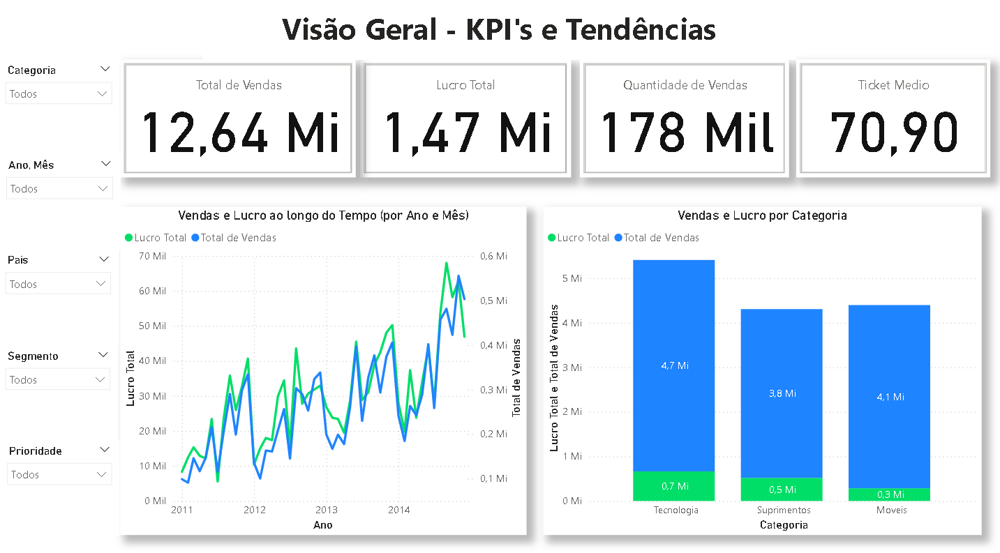
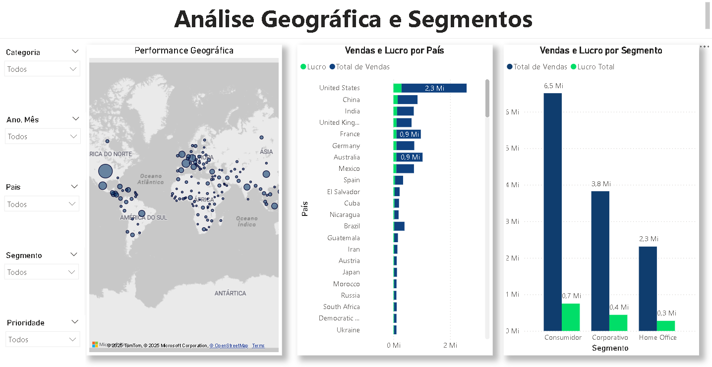
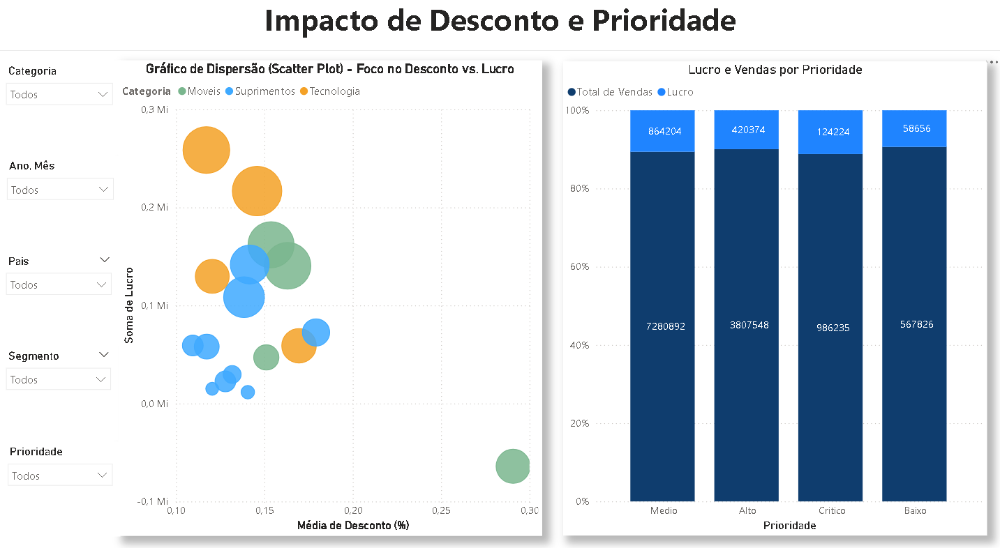

# Projeto de Portfólio: Dashboard de Análise de Performance de Campanhas Globais de Marketing no Power BI

## Uma Jornada Analítica: Da Carga de Dados ao Insight Acionável

Olá! Eu sou **Heitor Pereira Fernandes Oliveira**, e este projeto demonstra minha capacidade de transformar dados complexos em informações estratégicas e visualmente atraentes, essenciais para a tomada de decisões de negócio. Este dashboard de Análise de Marketing não é apenas uma coleção de gráficos, mas o resultado de um processo analítico completo, focado em resolver desafios reais de uma empresa de e-commerce.

### O Desafio de Negócio

Em um cenário de marketing global, a complexidade dos dados de vendas, descontos e desempenho de campanhas pode obscurecer a verdadeira performance. O objetivo deste projeto foi desvendar essa complexidade, respondendo a perguntas críticas para a estratégia de marketing:

* Qual é a saúde financeira geral (vendas e lucro) da empresa ao longo do tempo?
* Onde estamos performando melhor geograficamente e em quais segmentos de clientes?
* Quais produtos e categorias são os verdadeiros motores de receita e lucro?
* Como as estratégias de desconto impactam nossa rentabilidade?
* Existe uma relação entre a prioridade dos pedidos e o sucesso das vendas?

### A Solução Analítica: Um Dashboard Interativo no Power BI

Para enfrentar esses desafios, desenvolvi um dashboard trifásico e interativo no Power BI, projetado para guiar o usuário desde uma visão geral de alto nível até detalhes específicos que impulsionam o negócio.

#### 📊 Fontes de Dados

O projeto foi construído a partir de um robusto dataset simulado de vendas de e-commerce, contendo aproximadamente **51.900 linhas**. Este conjunto de dados abrangia informações cruciais como: `ID_Pedido`, `Data_Pedido`, `ID_Cliente`, `Segmento`, `Regiao`, `Pais`, `Product ID`, `Categoria`, `SubCategoria`, `Total_Vendas`, `Quantidade`, `Desconto`, `Lucro`, e `Prioridade`.

#### 🛠️ Tecnologias e Habilidades Demonstradas

* **Microsoft Power BI Desktop:** Utilizado para todo o ciclo de vida do projeto – desde a conexão e limpeza de dados (ETL), passando pela modelagem de dados, até a criação de visuais e dashboards interativos.
* **DAX (Data Analysis Expressions):** Habilidade fundamental na criação de medidas e colunas calculadas complexas, como `Lucro Total` e `Ticket Médio`, garantindo a precisão e a profundidade analítica.
* **Análise Exploratória de Dados (EDA):** Processo de investigação inicial para entender a estrutura dos dados, identificar padrões e anomalias, e guiar a escolha dos KPIs e das visualizações mais eficazes.
* **Visualização de Dados e Storytelling:** Seleção estratégica de tipos de gráficos (KPIs, linhas de tendência, mapas, barras, scatter plots) e organização das páginas para contar uma história clara e lógica, facilitando a compreensão dos insights por qualquer público.
* **Experiência do Usuário (UX) em Dashboards:** Design intuitivo com filtros globais padronizados na lateral esquerda, permitindo uma navegação fluida e aprofundamento na análise.
* **Resolução de Problemas de Negócio:** Aplicação de habilidades analíticas para traduzir desafios de negócio em métricas e visuais acionáveis.

---

## Estrutura do Dashboard e Principais Insights

O dashboard é organizado em três páginas distintas, cada uma aprofundando em diferentes dimensões da performance de marketing:

### **1. Visão Geral - KPIs e Tendências**

Esta página serve como o "painel de controle", oferecendo uma visão instantânea da saúde geral do negócio.

* **KPIs Essenciais:** Destaque para `Total de Vendas`, `Lucro Total`, `Quantidade de Vendas` e `Ticket Médio`, fornecendo um resumo financeiro imediato.
* **Tendências ao Longo do Tempo:** Um gráfico de linha duplo permite observar a evolução e a sazonalidade das `Vendas` e do `Lucro` por `Ano` e `Mês`, crucial para identificar períodos de alta e baixa performance.
* **Desempenho por Categoria:** Barras empilhadas revelam a contribuição de `Vendas` e `Lucro` pelas principais `Categorias` de produtos, orientando onde focar os recursos.

### **2. Análise Geográfica e Segmentos**

Aqui, a análise se aprofunda na dimensão geográfica e no comportamento do cliente, identificando mercados e segmentos de maior impacto.

* **Performance Geográfica:** Um mapa interativo exibe a `Distribuição de Pedidos`, `Vendas` e `Lucro` por `País`, facilitando a identificação visual de mercados fortes e oportunidades de expansão.
* **Vendas e Lucro por País:** Um gráfico de barras detalha os `Top N Países` em termos de `Vendas` e `Lucro`, fornecendo uma visão granular da contribuição de cada mercado.
* **Vendas e Lucro por Segmento:** Uma análise comparativa do desempenho entre `Consumidor`, `Corporativo` e `Home Office` orienta estratégias de marketing direcionadas.

### **3. Impacto de Desconto e Prioridade**

Esta página mergulha em análises táticas, desvendando a eficácia das políticas de desconto e a influência da prioridade dos pedidos.

* **Desconto vs. Lucro (Scatter Plot):** Um gráfico de dispersão inovador visualiza a relação entre a `Média de Desconto` e o `Lucro Total` por `SubCategoria`, com o tamanho da bolha representando `Total de Vendas`. Este visual é crucial para identificar produtos que "queimam" margem ou que são excelentes geradores de lucro mesmo com descontos.
* **Vendas e Lucro por Prioridade:** Um gráfico de barras compara `Vendas` e `Lucro` entre os diferentes níveis de `Prioridade` dos pedidos, revelando se os recursos alocados para pedidos prioritários estão se traduzindo em resultados financeiros proporcionais.

---

## Dashboard Interativo (Power BI Service)

**Experimente o dashboard completo e interaja com os dados online:**

[**Acesse o Dashboard de Análise de Marketing no Power BI Service aqui!**](SUA_URL_DO_POWER_BI_SERVICE_AQUI)

*Substitua `SUA_URL_DO_POWER_BI_SERVICE_AQUI` pelo link real do seu dashboard após a publicação.*

## Como Abrir e Explorar o Projeto Localmente

Para explorar este dashboard em seu próprio Power BI Desktop:

1.  **Pré-requisito:** Baixe e instale o [Microsoft Power BI Desktop](https://powerbi.microsoft.com/desktop/).
2.  **Clone o Repositório:** Utilize o Git para clonar este repositório para o seu ambiente local.
3.  **Abra o Arquivo:** Navegue até a pasta `dashboards` dentro do repositório clonado e abra o arquivo `Analise_Marketing.pbix`.

## Conecte-se Comigo!

Estou sempre em busca de novas oportunidades e desafios em Análise de Dados. Sinta-se à vontade para se conectar:

* **LinkedIn:** [Heitor Pereira Fernandes Oliveira](https://www.linkedin.com/in/heitor-pereira-fernandes-oliveira-412aa3145/)
* **Email:** [heitorfernandesoliveira@outlook.com](mailto:heitorfernandesoliveira@outlook.com)

---
*Este projeto foi desenvolvido por **Heitor Pereira Fernandes Oliveira** como parte do meu portfólio de Análise de Dados.*